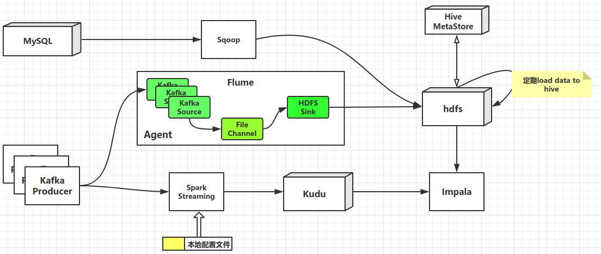
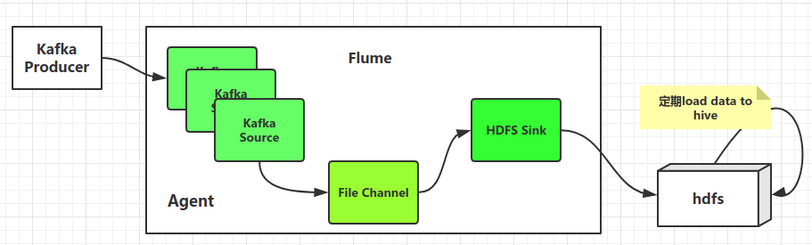
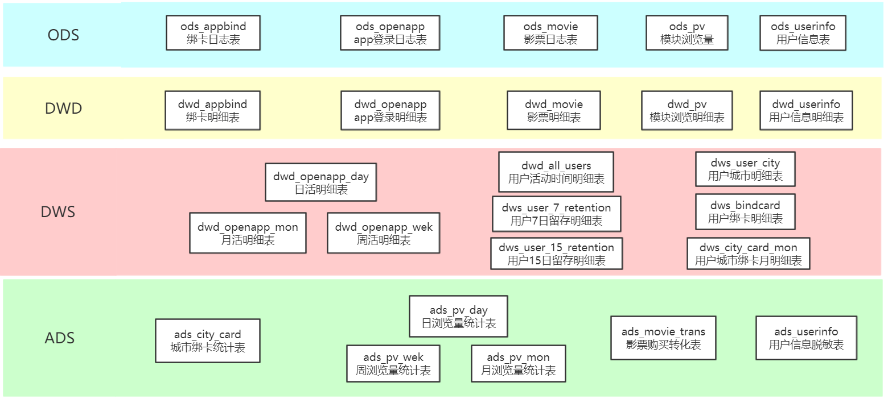
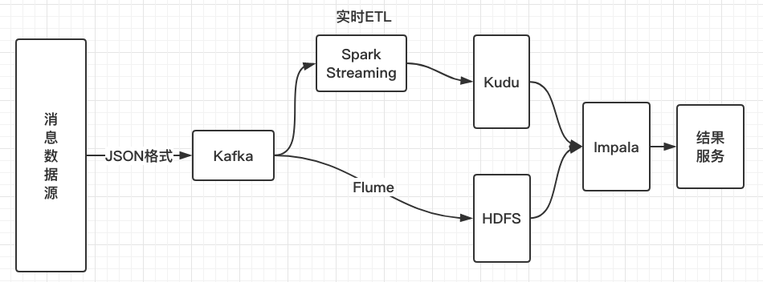

# Realtime-Data-Warehouse
本项目涉及实时数据仓库搭建相关，是实习期间和几位大神朋友一起协作完成的课题，在此感谢几位大佬@鑫锋@葛老师@丁哥的帮助

## 技术路线

一图胜千言，如图是所使用的大数据组件，离线数仓的搭建涉及Kafka、Flume、Sqoop、Hive，实时路线包含Kafka、SparkStreaming、Kudu，最终的展示由Impala查询Hive和Kudu上相关数据，作OLAP分析，分析结果由Tableau展示

- 离线数据采集

  - Kafka+Flume+HDFS 构建消息采集系统

  

  - Sqoop作数据库到数仓的桥梁

- 数据仓库数据分层和维度建模的设计

  

- 实时消息处理

